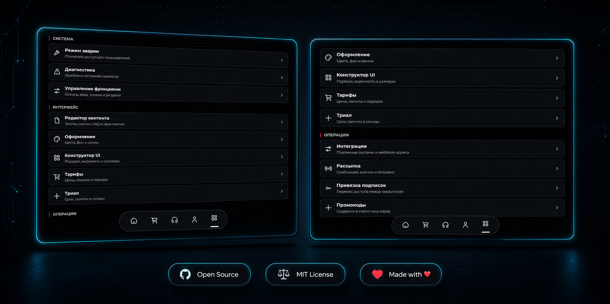

<div align="center">

<p>
  <b>Русский</b> · <a href="README_EN.md">English</a>
</p>


# Link-Bot

**Telegram-бот и Mini App для продажи и управления VPN-подписками Remnawave**

<p>
  <a href="https://t.me/BruhvpnBot">
    
  </a>
  <a href="https://t.me/REMNALinkBot">
    
  </a>
</p>

<p>
  
  
  
</p>

[Попробовать бота](https://t.me/BruhvpnBot) · [Сообщество в Telegram](https://t.me/REMNALinkBot) · [Remnawave](https://github.com/remnawave/panel)

</div>

---

## 🧩 Что такое Link-Bot?

**Link-Bot** — Telegram-бот и Mini App для продажи и управления VPN-подписками Remnawave.

Он объединяет личный кабинет пользователя, оплату, управление подписками, поддержку и администрирование в одном интерфейсе.

> 🤖 **Демонстрация:** [открыть Link-Bot в Telegram](https://t.me/BruhvpnBot)  
> 💬 **Сообщество:** [новости, вопросы и обсуждения](https://t.me/REMNALinkBot)

---

## ✨ Возможности

| 📦 Подписки и тарифы | 💳 Платежи |
|---|---|
| • Личный кабинет в Telegram Mini App и браузере<br>• Создание и продление подписок Remnawave<br>• Тарифы, триал и выбор внутренних/внешних сквадов<br>• Привязка и перенос подписок между Telegram-аккаунтами | • YooKassa<br>• Crypto Pay<br>• Telegram Stars<br>• Lava<br>• WATA<br>• Platega<br>• FreeKassa<br>• Heleket<br>• Pally |

| 📣 Продвижение и уведомления | 🛠️ Администрирование |
|---|---|
| • Промокоды<br>• Реферальная система<br>• Рассылки<br>• Уведомления об окончании подписки и ошибках | • Поддержка с тикетами и FAQ<br>• Режим технических работ<br>• Редактор контента, оформления и функций прямо в админке |

---

## 🛠️ Админ-панель

Управляйте системой, интерфейсом, тарифами, интеграциями, рассылками, промокодами и другими функциями прямо из Mini App.

<div align="center">
  
</div>

---

## 📋 Требования

| Компонент | Требование |
|---|---|
| 🖥️ Сервер | VPS с Ubuntu 22.04/24.04 или Debian 12 |
| 🌐 Домен | Домен с `A`-записью на IP сервера |
| 🔌 Порты | Открытые порты `22`, `80` и `443` |
| 🌊 Remnawave | Установленная и доступная панель Remnawave |
| 🤖 Telegram | Бот, созданный через [@BotFather](https://t.me/BotFather) |

---

## 🚀 Быстрая установка

### 1. Подготовьте домен

Создайте у DNS-провайдера запись:

```text
Тип: A
Имя: bot
Значение: IP_ВАШЕГО_VPS
```

В примерах ниже используется домен `bot.example.com`. Дождитесь обновления DNS перед первым запуском.

### 2. Установите Docker и Git

```bash
apt update && apt install -y git curl
curl -fsSL https://get.docker.com | sh
systemctl enable --now docker
```

### 3. Скачайте Link-Bot

```bash
cd /opt
git clone https://github.com/bruhxax/Link-Bot.git
cd Link-Bot
```

### 4. Создайте `.env`

```bash
cp .env.example .env
nano .env
```

Минимально заполните:

```dotenv
TELEGRAM_TOKEN=токен_бота_от_BotFather
ADMIN_TELEGRAM_ID=ваш_telegram_id

REMNAWAVE_URL=https://panel.example.com
REMNAWAVE_TOKEN=токен_remnawave
REMNAWAVE_MODE=remote

POSTGRES_USER=linkbot
POSTGRES_PASSWORD=сложный_пароль
POSTGRES_DB=linkbot

PUBLIC_HOST=bot.example.com
PUBLIC_BASE_URL=https://bot.example.com

REFERRAL_DAYS=0
```

Сгенерировать пароль PostgreSQL:

```bash
openssl rand -hex 24
```

> [!IMPORTANT]
> Не добавляйте `https://` в `PUBLIC_HOST`.  
> В `PUBLIC_BASE_URL`, наоборот, нужен полный HTTPS-адрес.

### 5. Запустите бота

```bash
docker compose up -d --build
```

Caddy автоматически получит TLS-сертификат. Проверка:

```bash
docker compose ps
curl https://bot.example.com/healthcheck
```

### 6. Выполните первый запуск

1. Откройте бота и отправьте `/start`.
2. Откройте Mini App под аккаунтом из `ADMIN_TELEGRAM_ID`.
3. Перейдите в раздел **Админка**.
4. Настройте интеграции, тарифы, триал, сквады, контент и функции.
5. В [@BotFather](https://t.me/BotFather) выполните `/setdomain` и укажите `bot.example.com`.

> [!NOTE]
> Платёжные ключи, тарифы, триал, промокоды, ссылки, баннеры и оформление задаются через админку. Хранить их в `.env` не требуется.

---

## 🖼️ Собственные баннеры

Готовые баннеры в репозиторий не включены. Загрузите свои файлы в нужную папку:

```text
assets/telegram/menu/
assets/telegram/verification/
assets/telegram/commerce/
assets/telegram/success/
```

После загрузки укажите путь в редакторе контента, например:

```text
/assets/telegram/menu/banner.png
```

> Пустое поле означает отправку сообщения без баннера.

---

## 🧰 Полезные команды

Все команды выполняются из `/opt/Link-Bot`.

<details>
<summary><b>📊 Статус контейнеров</b></summary>

```bash
docker compose ps
```

</details>

<details>
<summary><b>📜 Логи бота</b></summary>

```bash
docker compose logs -f --tail=200 bot
```

</details>

<details>
<summary><b>🔐 Логи HTTPS-прокси</b></summary>

```bash
docker compose logs -f --tail=200 caddy
```

</details>

<details>
<summary><b>🔄 Перезапуск бота</b></summary>

```bash
docker compose restart bot
```

</details>

<details>
<summary><b>♻️ Перезапуск всего проекта</b></summary>

```bash
docker compose restart
```

</details>

<details>
<summary><b>⏯️ Остановка и запуск</b></summary>

```bash
docker compose stop
docker compose start
```

</details>

<details>
<summary><b>⬆️ Обновление</b></summary>

```bash
git pull --ff-only
docker compose up -d --build --force-recreate --remove-orphans
```

Обновление сохраняет базу данных и настройки из админки. Уже созданные тарифы, оформление и интеграции не сбрасываются на новые значения по умолчанию.

</details>

<details>
<summary><b>💾 Резервная копия базы</b></summary>

```bash
docker compose exec -T db sh -c 'pg_dump -U "$POSTGRES_USER" "$POSTGRES_DB"' > link-bot-backup.sql
```

</details>

<details>
<summary><b>📥 Восстановление базы</b></summary>

```bash
cat link-bot-backup.sql | docker compose exec -T db sh -c 'psql -U "$POSTGRES_USER" "$POSTGRES_DB"'
```

</details>

<details>
<summary><b>🗑️ Удаление контейнеров без удаления базы</b></summary>

```bash
docker compose down
```

> [!CAUTION]
> `docker compose down -v` удаляет базу данных и настройки без возможности восстановления.

</details>

---

## 🏗️ Структура проекта

| Путь | Назначение |
|---|---|
| `cmd/` | Запуск приложения |
| `db/migrations/` | Миграции PostgreSQL |
| `internal/` | Логика бота, Mini App и интеграций |
| `translations/` | Тексты Telegram-бота |
| `assets/telegram/` | Пользовательские баннеры |
| `docker-compose.yaml` | Bot, PostgreSQL и Caddy |
| `.env.example` | Параметры первого запуска |

---

## 🔒 Безопасность

| Рекомендация | Описание |
|---|---|
| 🔑 Секреты | Не публикуйте `.env`, токены и резервные копии |
| 🐘 PostgreSQL | Используйте отдельный сложный пароль |
| 🛡️ SSH | Ограничьте SSH-доступ и используйте ключи вместо пароля |
| 💾 Обновления | Перед обновлением создавайте резервную копию базы |

---

## 💬 Сообщество

<div align="center">

<a href="https://t.me/REMNALinkBot">
  
</a>
<a href="https://t.me/BruhvpnBot">
  
</a>

**Вопросы и обсуждения:** [t.me/REMNALinkBot](https://t.me/REMNALinkBot)  
**Демонстрация бота:** [t.me/BruhvpnBot](https://t.me/BruhvpnBot)

</div>
