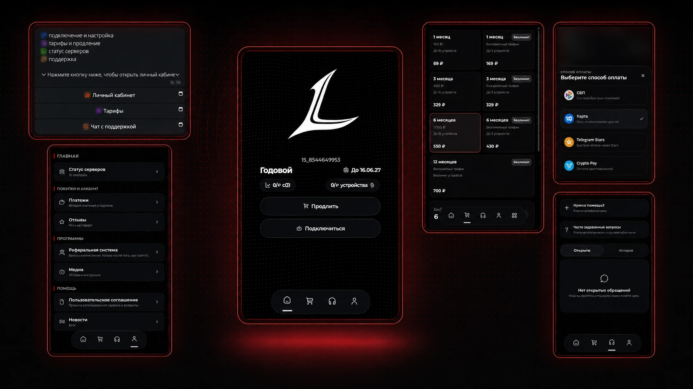

<div align="center">
  
  <h1>Link-Bot</h1>
  <p><b>Telegram-бот и mini app для продажи и управления VPN-подписками Remnawave.</b></p>

  
  
  
</div>

## Возможности

- личный кабинет в Telegram mini app и браузере;
- создание и продление подписок Remnawave;
- тарифы, триал и выбор внутренних/внешних сквадов;
- YooKassa, Crypto Pay, Telegram Stars, Lava, WATA, Platega, FreeKassa и Heleket;
- промокоды, реферальная система и рассылки;
- поддержка с тикетами и FAQ;
- уведомления об окончании подписки и ошибках;
- режим технических работ;
- редактор контента, оформления и функций прямо в админке;
- привязка и перенос подписок между Telegram-аккаунтами.

## Требования

- VPS с Ubuntu 22.04/24.04 или Debian 12;
- домен с `A`-записью на IP сервера;
- открытые порты `22`, `80` и `443`;
- установленная и доступная панель Remnawave;
- Telegram-бот, созданный через [@BotFather](https://t.me/BotFather).

## Быстрая установка

### 1. Подготовьте домен

Создайте у DNS-провайдера запись:

```text
Тип: A
Имя: bot
Значение: IP_ВАШЕГО_VPS
```

В примерах ниже используется домен `bot.example.com`. Дождитесь обновления DNS перед первым запуском.

### 2. Установите Docker и Git

```bash
apt update && apt install -y git curl
curl -fsSL https://get.docker.com | sh
systemctl enable --now docker
```

### 3. Скачайте Link-Bot

```bash
cd /opt
git clone https://github.com/bruhxax/Link-Bot.git
cd Link-Bot
```

### 4. Создайте `.env`

```bash
cp .env.example .env
nano .env
```

Минимально заполните:

```dotenv
TELEGRAM_TOKEN=токен_бота_от_BotFather
ADMIN_TELEGRAM_ID=ваш_telegram_id

REMNAWAVE_URL=https://panel.example.com
REMNAWAVE_TOKEN=токен_remnawave
REMNAWAVE_MODE=remote

POSTGRES_USER=linkbot
POSTGRES_PASSWORD=сложный_пароль
POSTGRES_DB=linkbot

PUBLIC_HOST=bot.example.com
PUBLIC_BASE_URL=https://bot.example.com

REFERRAL_DAYS=0
```

Сгенерировать пароль PostgreSQL:

```bash
openssl rand -hex 24
```

Не добавляйте `https://` в `PUBLIC_HOST`. В `PUBLIC_BASE_URL`, наоборот, нужен полный HTTPS-адрес.

### 5. Запустите бота

```bash
docker compose up -d --build
```

Caddy автоматически получит TLS-сертификат. Проверка:

```bash
docker compose ps
curl https://bot.example.com/healthcheck
```

### 6. Выполните первый запуск

1. Откройте бота и отправьте `/start`.
2. Откройте mini app под аккаунтом из `ADMIN_TELEGRAM_ID`.
3. Перейдите в раздел **Админка**.
4. Настройте интеграции, тарифы, триал, сквады, контент и функции.
5. В [@BotFather](https://t.me/BotFather) выполните `/setdomain` и укажите `bot.example.com`.

Платёжные ключи, тарифы, триал, промокоды, ссылки, баннеры и оформление задаются через админку. Хранить их в `.env` не требуется.

## Собственные баннеры

Готовые баннеры в репозиторий не включены. Загрузите свои файлы в нужную папку:

```text
assets/telegram/menu/
assets/telegram/verification/
assets/telegram/commerce/
assets/telegram/success/
```

После загрузки укажите путь в редакторе контента, например:

```text
/assets/telegram/menu/banner.png
```

Пустое поле означает отправку сообщения без баннера.

## Полезные команды

Все команды выполняются из `/opt/Link-Bot`.

### Статус контейнеров

```bash
docker compose ps
```

### Логи бота

```bash
docker compose logs -f --tail=200 bot
```

### Логи HTTPS-прокси

```bash
docker compose logs -f --tail=200 caddy
```

### Перезапуск бота

```bash
docker compose restart bot
```

### Перезапуск всего проекта

```bash
docker compose restart
```

### Остановка и запуск

```bash
docker compose stop
docker compose start
```

### Обновление

```bash
git pull
docker compose up -d --build --remove-orphans
```

### Резервная копия базы

```bash
docker compose exec -T db sh -c 'pg_dump -U "$POSTGRES_USER" "$POSTGRES_DB"' > link-bot-backup.sql
```

### Восстановление базы

```bash
cat link-bot-backup.sql | docker compose exec -T db sh -c 'psql -U "$POSTGRES_USER" "$POSTGRES_DB"'
```

### Удаление контейнеров без удаления базы

```bash
docker compose down
```

> `docker compose down -v` удаляет базу данных и настройки без возможности восстановления.

## Структура

```text
cmd/                  запуск приложения
db/migrations/        миграции PostgreSQL
internal/             логика бота, mini app и интеграций
translations/         тексты Telegram-бота
assets/telegram/      пользовательские баннеры
docker-compose.yaml   bot, PostgreSQL и Caddy
.env.example          параметры первого запуска
```

## Безопасность

- не публикуйте `.env`, токены и резервные копии;
- используйте отдельный сложный пароль PostgreSQL;
- ограничьте SSH-доступ и используйте ключи вместо пароля;
- перед обновлением создавайте резервную копию базы.
